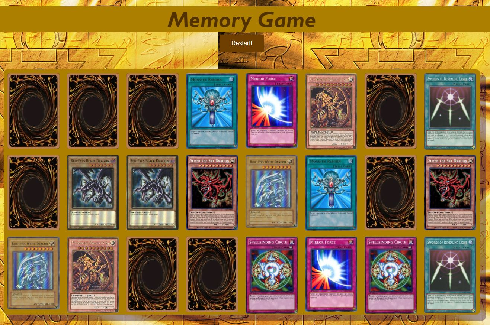

# Yu-Gi-Oh! Card Memory Game!

This creates a memory game where you flip cards and if they match, you keep them flipped. You win by having all of the cards flipped. I had a lot of fun making this game because it reminded me of when I used to play this as a child with my uncles. I also played with Yu-Gi-Oh cards growing up, so this really brings me nostalgia.
### Rules:
- Click on two cards to reveal their front sides
- If you get two cards that match, then they stay flipped
- If the cards don't match, then they are flipped back over, hiding the cards
- Your goal is to match all of the cards in the fewest amount of tries. I hope your brain is up to the challenge!
